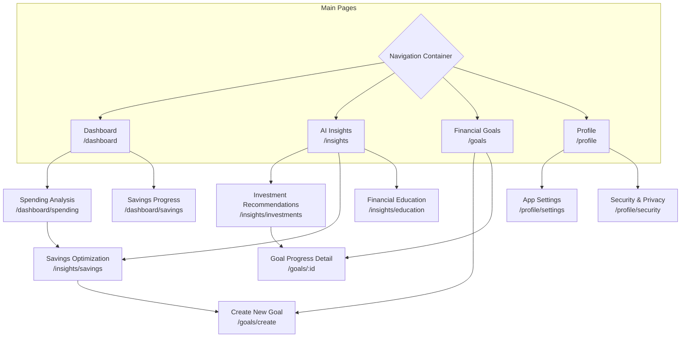

# User Flow — FinSmart AI Mobile App

```mermaid
graph TD
  %% Navigation Container (Max 4 pages)
  NavContainer{Navigation Container}

  %% Core Pages (accessible from main navigation)
  subgraph "Main Pages"
    NavContainer --> Dashboard["Dashboard<br/>/dashboard"]
    NavContainer --> Insights["AI Insights<br/>/insights"]
    NavContainer --> Goals["Financial Goals<br/>/goals"]
    NavContainer --> Profile["Profile<br/>/profile"]
  end

  %% Detail and Action Pages (2 levels maximum)
  Dashboard --> SpendingAnalysis["Spending Analysis<br/>/dashboard/spending"]
  Dashboard --> SavingsProgress["Savings Progress<br/>/dashboard/savings"]
  
  Insights --> InvestmentAdvice["Investment Recommendations<br/>/insights/investments"]
  Insights --> SavingsTips["Savings Optimization<br/>/insights/savings"]
  Insights --> EducationContent["Financial Education<br/>/insights/education"]
  
  Goals --> CreateGoal["Create New Goal<br/>/goals/create"]
  Goals --> GoalDetail["Goal Progress Detail<br/>/goals/:id"]
  
  Profile --> Settings["App Settings<br/>/profile/settings"]
  Profile --> SecuritySettings["Security & Privacy<br/>/profile/security"]

  %% Cross-page Navigation (when applicable)
  SavingsTips --> CreateGoal
  InvestmentAdvice --> GoalDetail
  SpendingAnalysis --> SavingsTips
```